# hobby-kernel

**한국어** | [English](README.en.md)



C로 바닥부터 만드는 **RISC-V 학습용 커널**. OS 내부(유저/커널 경계·시스템콜·프로세스·파일시스템)를 직접 구현하며 공부하는 게 목표. 참고서로 [xv6(MIT 6.S081)](https://pdos.csail.mit.edu/6.828/2023/xv6.html)를 본다.

## 빌드 & 실행

```bash
# 사전: riscv64 크로스 컴파일러 + QEMU
brew install riscv64-elf-gcc qemu

make          # build/kernel.elf
make run      # QEMU virt + OpenSBI로 부팅 (UART → stdout). 종료: Ctrl-A 다음 X
```

## 현재 상태

- **Step 0**: S-mode 부팅 + NS16550 UART 출력
- **Stage 1**: 트랩/인터럽트 + 타이머 (stvec, sstc)
- **키보드 입력**: PLIC 외부 인터럽트 + UART RX
- **커널 셸**: help / about / uptime / mem / clear / whoami / echo
- **페이지 할당기**: kalloc/kfree (물리 메모리 ~125MB)
- **Stage 2**: 페이징(Sv39 3단계 페이지 테이블, 커널 식별 매핑)
- **Stage 3**: 유저모드 + 시스템콜 (U-mode 진입, `ecall` → putchar/print 디스패치)
- **Stage 4**: 프로세스 + 선점형 스케줄러 (swtch.S 컨텍스트 스위치, 타이머 선점, 셸 복귀 + `ps`)
- **Stage 5**: 유저 프로세스 (프로세스별 페이지 테이블=주소공간 격리, 스케줄러가 U-mode로 실행, `SYS_exit` 생명주기)
- **Stage 5+**: `fork()` — 주소공간 복사로 프로세스 복제(부모=자식 pid, 자식=0), pid
- **Stage 5++**: ELF 로더 — 따로 컴파일한 유저 프로그램(`user/init.c`)을 ELF로 임베드, 커널이 프로그램 헤더를 파싱해 적재
- **Stage 6**: 파일시스템 — virtio-blk 디스크 드라이버(모던 MMIO, 폴링) + 읽기 전용 FS(슈퍼블록/디렉터리/데이터), 셸 `ls`/`cat`
- **Stage 7**: 런타임 `exec()` — 디스크의 ELF 프로그램으로 현재 프로세스를 교체. `fork` + `exec("hello")`로 디스크의 별도 프로그램 실행
- **Stage 7+**: 유저공간 셸 — sleep/wakeup으로 블로킹 `read`, `wait`(부모가 자식 종료 대기), 셸이 U-mode에서 돌며 `ls`/`cat`/`mem`(내장) + 디스크 프로그램(fork+exec)을 실행
- **자원 회수**: exec는 페이지 테이블/스택을 재사용(코드만 교체)해 누수 없음, `wait`가 종료한 자식의 유저 페이지+페이지 테이블을 회수 — `hello`를 반복 실행해도 `mem`이 일정
- **Lazy allocation (demand paging)**: `sbrk`는 힙만 키우고 페이지는 안 줌 → 처음 접근 시 페이지 폴트로 할당. 예외 핸들러가 실제로 메모리를 만든다(디스크 프로그램 `lazytest`로 시연)
- **mmap**: 파일을 주소공간에 매핑 → `read()` 없이 메모리 접근만으로 읽음. 폴트 시 해당 파일 블록을 디스크에서 적재(디스크 프로그램 `mmaptest`로 시연). 페이지 폴트 핸들러가 힙·mmap 둘 다 처리
- **쓰기 가능 FS**: 셸 `write <file> <text>`로 파일 생성 — 빈 블록 할당 + 데이터 쓰기 + 디렉터리/슈퍼블록 디스크 갱신. **재부팅해도 영속**(disk write). virtio 쓰기 경로 동작 확인
- **Stage 8: 네트워킹**: virtio-net 드라이버(RX/TX 큐, 12B net 헤더) + 미니 스택(이더넷/ARP/IP/UDP/ICMP/DNS). 부팅 시 ARP로 게이트웨이 MAC 해석 → ICMP로 게이트웨이 ping(왕복) → DNS 질의. QEMU user(SLIRP) 네트워킹 상대로 검증
- **Copy-on-Write fork**: 물리 페이지 참조 카운트(`kalloc`) + fork 시 코드·힙 페이지를 복사 대신 읽기 전용 공유(PTE_COW). 쓰기 폴트가 나는 "그 순간" 복제 → 부모/자식 격리. 스택만 사적 복사(트랩 프레임이 유저 스택 위에 있어 공유 불가). `cowtest`로 시연 — 자식이 99를 써도 부모는 42, 메모리 누수 없음
- **저널링 파일시스템**: 모든 쓰기를 트랜잭션으로 — 데이터/디렉터리/슈퍼블록을 로그 영역에 모은 뒤 커밋 표시 → 제자리에 설치(install). 크래시 시 마운트에서 복구(replay)해 원자성 보장. 셸 `rm <file>` 삭제 + 마운트 때 디렉터리로 빈 블록 비트맵을 재구성해 블록 재사용. 재부팅해도 영속
- **TCP**: net 스택 위에 TCP 세그먼트(시퀀스/ACK 회계, 의사헤더 체크섬) + 수동 개방 서버. 셸 `tcp`로 :5599에서 한 연결을 받아 3-way 핸드셰이크 → 데이터 수신 → 에코 → FIN 종료. 호스트가 `hostfwd`로 접속해 검증(에코 왕복 확인)
- **유저 스레드(uthread)**: 협조적 유저 스레드 — 유저공간 컨텍스트 스위치(`uswitch`)로 스레드가 `uyield`로 양보, 스케줄러가 round-robin. 단일 페이지(R\|X) 모델이라 전역을 못 쓰는 제약을 힙 고정주소(0x10000)에 상태를 두고 힙 스택을 pre-fault해 우회. `uthread`로 3스레드 교대 실행 시연

> 트랩 프레임에 `sepc`/`sstatus`를 저장해 여러 프로세스의 트랩이 인터리빙돼도 안전. 유저 프로세스 트랩은 SUM 비트로 유저 스택에서 처리(트램폴린 단순화). fork는 부모의 트랩 프레임이 유저 스택에 있다는 점을 이용 — 스택 페이지를 복사하면 같은 VA에 프레임이 그대로 들어가, `forkret`이 그 프레임으로 복귀. exec는 주소공간을 바꾸면 유저 스택이 통째로 바뀌므로, satp 전환 후 sret까지를 스택을 건드리지 않는 어셈블리(`userret_to`)로 처리. 유저 프로그램은 `user/`에서 별도 컴파일 → `init`은 `.incbin` 임베드, `hello`는 디스크에 적재. virtio used 링은 비동기 갱신이라 `volatile`로 읽는다.

## 학습 로드맵 (xv6 6.1810 랩 기준)

| 랩 | 주제 | 상태 |
|---|---|---|
| util / syscall / pgtbl / traps | 유틸·시스템콜·페이지테이블·트랩 | 완료 |
| **가상메모리 (paging)** | **Sv39 3단계 페이지테이블, 커널 식별 매핑, 프로세스별 페이지테이블=주소공간 격리, satp 전환** | **완료** |
| lazy | 지연 할당(demand paging) | 완료 |
| mmap | 메모리 맵 파일 | 완료 |
| fs | 저널링 FS(생성/삭제/영속) | 완료 — write-ahead 로그(커밋→설치, 마운트 복구), `rm` 삭제 + 빈 블록 비트맵 재사용. inode 간접블록은 미구현(연속 할당) |
| cow | Copy-on-Write fork | 완료 — 물리 페이지 refcount + 쓰기 폴트 시 복제. 코드·힙 페이지는 COW 공유, 스택만 사적 복사(트랩 프레임을 유저 스택에 두는 설계 때문). `cowtest`로 시연 |
| thread | 유저 스레드(uthread) | 완료 — 협조적 유저 스레드(유저공간 컨텍스트 스위치 uswitch). 전역 대신 힙 고정주소(0x10000)에 상태 배치 + 힙 스택 pre-fault로 단일 페이지 모델 제약 우회. `uthread`로 시연 |
| lock | 병렬성·락(멀티코어 SMP) | 완료 — 3코어가 공유 proctable에서 동시 스케줄. 락 baton(swtch 가로지르며 전달), `sscratch`로 hartid 복구, kalloc·콘솔·uart 락. (fs 락은 정제) |
| net | 네트워크 스택 | 완료 — virtio-net + 이더넷/ARP/IP/UDP/ICMP/DNS + **TCP**. ARP로 게이트웨이 MAC 해석, ICMP ping 왕복, DNS 질의(외부망 필요), TCP 서버(3-way 핸드셰이크/데이터/에코/종료, 셸 `tcp`) |

> xv6 6.1810 랩(util/syscall/pgtbl/traps/lazy/mmap/fs/cow/thread/lock/net)은 **전부 완료**.
>
> **가상메모리(VM)** 는 단일 랩이 아니라 여러 랩에 걸쳐 완성됨 — **Sv39 페이징(paging) + 프로세스별 주소공간 격리 + demand paging(lazy) + mmap + copy-on-write(cow) + 페이지 폴트 핸들러**. 즉 "가상주소→물리 변환, 격리, 폴트로 페이지 만들기"라는 VM의 핵심은 모두 구현됨. 남은 건 *정제*(스왑/거대페이지/ASID/ASLR 등, 아래 다음 로드맵 참고).

## 다음 로드맵 (더 배울 것)

xv6 입문 랩을 넘어 더 붙여볼 주제들. **전부 미구현**이고(코드 먼저 → 그다음 글), 실제 코드 상태 기준으로 *추천 순서*와 *무엇 위에 쌓는지*까지 정리한다.

### 추천 순서 (의존성 + 기존 코드 재사용 기준)

1. **파이프 + 시그널** — 1순위. `sleep/wakeup`을 그대로 재사용하고, `SIGALRM`이 [10편 uthread]를 **선점형**으로 바꾼다(연재 떡밥 회수).
2. **mprotect** — 가장 작음(난이도 하). `vm.c`의 PTE 갱신 + TLB flush만.
3. **프로세스 생애 정제**(`kill`/`waitpid`/좀비 재양육) — 시그널과 같이 가면 자연스럽다.
4. **자동 스택 성장 → FS 간접 블록** — 아래 ※의 "단일 페이지 모델"을 처음 벗어나는 단계.
5. 그 이후 — MLFQ · 슬랩/버디 · 스왑 · 거대 페이지 · ASID · ASLR · 공유메모리 · 네임스페이스 · TCP 정제.

> ※ **공통 제약(단일 페이지 모델)**: 지금 커널은 유저 코드·스택·힙이 각각 1페이지다(`USERVA`/`USERSTACK`/`HEAPBASE`). **자동 스택 성장**, **큰 파일(inode 간접 블록)**, **거대 페이지**는 모두 이 모델을 부분적으로 깨야 하므로 묶어서 보는 게 좋다.

#### IPC / 시그널
| 주제 | 무엇을 / 왜 | 전제(기존 코드) | 난이도 |
|---|---|---|---|
| **파이프 + 시그널** | 셸 파이프라인(`ls \| cat`) + 비동기 시그널(Ctrl-C, `SIGALRM`). 시그널로 uthread를 선점형으로 → 협조 vs 선점 직접 비교 | `sleep/wakeup`·트랩·콘솔(`proc.c`/`trap.c`/`console.c`) | 중 |
| **공유 메모리 IPC** | mmap을 프로세스 간 공유 모드로 — 여러 프로세스가 같은 물리 페이지 | `proc_mmap`·`vm.c` | 중 |

#### 프로세스 / 스케줄링
| 주제 | 무엇을 / 왜 | 전제(기존 코드) | 난이도 |
|---|---|---|---|
| **프로세스 생애 정제** | 고아 init 재양육, 좀비 회수, `nice`, `waitpid`/`WNOHANG`, `kill` | `wait/exit`(`proc.c`) + 시그널 | 중 |
| **MLFQ 스케줄러** | round-robin → 다단계 피드백 큐(우선순위 + aging). 대화형 응답성↑ | `scheduler`(`proc.c`) | 중 |
| **백그라운드 / 데몬** | 셸 `cmd &`, 작업 제어(세션·프로세스 그룹), 데몬화(double-fork + `setsid`) | 셸(`init.c`)·`fork/wait` | 중 |
| **커널 스레드(`clone`)** | 주소공간 공유 흐름을 **커널이** 스케줄해 멀티코어 활용(우리 uthread는 유저 협조적이라 1코어) | `swtch`·스케줄러 | 중상 |

#### 메모리 / VM 정제
| 주제 | 무엇을 / 왜 | 전제(기존 코드) | 난이도 |
|---|---|---|---|
| **mprotect** | 런타임 페이지 권한 변경(R/W/X) — PTE 플래그 갱신 + TLB flush | `vm.c walk`/PTE | 하 |
| **자동 스택 성장** | 가드 페이지 + 폴트로 유저 스택 자동 확장 (※) | `proc_pagefault` | 중 |
| **거대 페이지** | Sv39 2MB/1GB 메가페이지로 TLB 효율↑ (상위 레벨 leaf) (※) | `vm.c walk` | 중 |
| **TLB / ASID** | 주소공간 전환 때 전체 flush 대신 ASID로 선택 무효화 | `switch_satp`(`vm.c`) | 중 |
| **ASLR** | 코드/스택/힙 배치 무작위화(보안) | ELF 로더(`elf.c`)·주소 배치 | 중 |
| **스왑 / 페이지 교체** | 메모리 부족 시 페이지를 디스크로 evict(LRU/Clock) | virtio-blk(`virtio.c`)·`proc_pagefault` | 중상 |

#### 할당기 / FS / 네트워크 / 격리
| 주제 | 무엇을 / 왜 | 전제(기존 코드) | 난이도 |
|---|---|---|---|
| **슬랩 / 버디 할당기** | freelist → 객체 캐싱 할당기로 단편화↓ (Bonwick 슬랩) | `kalloc`(`kalloc.c`) | 중 |
| **FS 정제** | inode 간접 블록(큰 파일) (※), 심볼릭 링크, fs 동시 접근 락 | 연속 할당(`fs.c`) | 중 |
| **TCP 정제** | 재전송 타이머·혼잡 제어(슬로스타트/AIMD)·윈도우·재정렬 버퍼 | TCP(`net.c`) | 상 |
| **네임스페이스(컨테이너 기초)** | PID/mount 네임스페이스로 프로세스 격리 — 도커의 뿌리 | proc 테이블·`fs.c` | 상 |

### 장기 응용 — "자작 JVM 위에서 게시판 CRUD"

이 커널을 *"진짜 프로그램이 도는 OS"* 로 끌고 가는 응용 목표. 두 트랙으로 나눠 진행한다.

- **트랙 A (가까운 캡스톤) — C HTTP 게시판**: 이미 있는 TCP(9편)·저널링 FS(8편 = `create`/`read`/`rm`/`ls` = CRUD 그 자체)·프로세스 위에 HTTP/1.0 파서 + 라우팅을 얹어, 내 커널에서 도는 게시판. *커널 한 바퀴(네트워크 → 처리 → 저장 → 응답)를 완성하는 작품.*
- **트랙 B (장기) — 직접 만드는 JVM(C/C++) 위 자바 게시판**: 별도 대형 프로젝트. **리눅스에서 먼저 완성한 뒤 커널로 포팅**한다(커널·JVM 동시 디버깅 회피).
  - **M1 (커널)**: 멀티페이지 유저 + 큰 힙 — *단일 페이지 모델 졸업이 JVM 포팅의 1번 관문*
  - **M2~M5 (리눅스)**: `.class` 파서 → 바이트코드 인터프리터(~200 opcode) → 힙/GC → 최소 `String`/`System.out` → 배열·컬렉션·파일 I/O → raw 소켓 → HTTP 게시판
  - **M6 (포팅)**: 네이티브 메서드를 커널 syscall(소켓·파일·mmap)로 교체
  - ※ 진짜 벽은 인터프리터가 아니라 **Java 표준 라이브러리**(`java.lang`/`util`/`io`/`net`) — 게시판이 실제로 쓰는 클래스만 골라 구현한다.

### 구현 너머 — 그 다음 코스
- **OSTEP**(Operating Systems: Three Easy Pieces): 보편 개념 심화, 프로젝트 절반이 xv6 확장
- **MIT 6.824 분산 시스템**: Raft 합의로 KV 스토어 4단계 구축 — 커널 다음의 자연스러운 길
- **Pintos**(스탠퍼드) / **리눅스 커널 기여**(실전 적용)

참고: [Self-Guided OS](https://jakegut.com/posts/sg-os/) · [OS 책 추천 15선](https://blog.codingconfessions.com/p/my-top-15-os-books) · [Bonwick 슬랩 논문](https://people.eecs.berkeley.edu/~kubitron/courses/cs194-24-S14/hand-outs/bonwick_slab.pdf) · [namespaces 커널뷰](https://www.schutzwerk.com/en/blog/linux-container-namespaces05-kernel/)

## 구조

```
hobby-kernel/
├── src/
│   ├── entry.S        # S-mode 진입점 (스택 설정 → kmain)
│   ├── kernelvec.S    # 트랩 진입/복귀 (+ forkret)
│   ├── swtch.S        # 컨텍스트 스위치
│   ├── uart/plic      # 장치 드라이버
│   ├── trap.c         # 트랩/인터럽트/타이머
│   ├── kalloc.c       # 물리 페이지 할당기
│   ├── vm.c           # Sv39 페이징 + 프로세스별 페이지 테이블
│   ├── proc.c         # 프로세스/스케줄러/fork/exec/wait/sleep
│   ├── elf.c          # ELF64 로더
│   ├── virtio.c       # virtio-blk 디스크 드라이버
│   ├── net.c          # virtio-net 드라이버 + 미니 네트워크 스택(ARP/IP/UDP/ICMP/DNS)
│   ├── fs.c           # 읽기 전용 파일시스템
│   ├── fsformat.h     # 온디스크 포맷(커널+mkfs 공유)
│   ├── console.c      # 콘솔 입력(라인 버퍼 + 블로킹 read)
│   ├── spinlock.c     # 스핀락 + 코어별 인터럽트 중첩(SMP)
│   ├── user.c         # 시스템콜 디스패치
│   ├── initcode.S     # 셸 ELF 임베드(.incbin)
│   └── main.c         # kmain
├── user/              # 따로 컴파일되는 유저 공간
│   ├── init.c         # 유저공간 셸(임베드)
│   ├── hello.c        # 디스크에 올라가는 예제 프로그램
│   ├── usys.h         # 시스템콜 래퍼
│   └── user.ld        # USERVA(0x1000)에 링크
├── tools/mkfs.c       # 디스크 이미지 빌더(호스트)
├── fs/                # 디스크에 담을 파일들
├── kernel.ld          # 0x8020_0000에 링크
└── Makefile           # make → 커널 + fs.img,  make run → QEMU(디스크 첨부)
```

## 스택

C · RISC-V (rv64imac) · riscv64-elf-gcc · QEMU(virt) · OpenSBI
